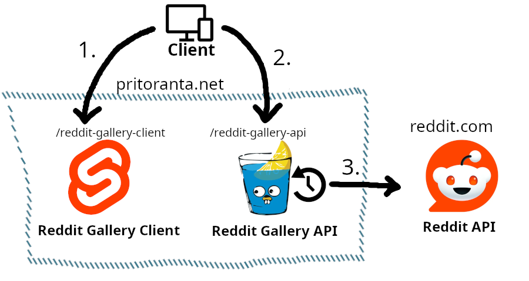

# Reddit Gallery API

Minimal Go [Gin](https://gin-gonic.com/) HTTP API for using Reddit API indirectly. The need arose from many browsers blocking cross-origin requests from [Reddit Gallery Client](https://github.com/pritoranta/reddit-gallery-client) to Reddit API directly. I decided against using a simple reverse proxy, because I only have a need for a couple endpoints, and I wanted to leave my options open for further customization. I ended up adding caching too, for less requests to Reddit API, and faster response times.

I decided to use Go because this project seemed like an ideal candidate; small and simple. It's my first go at Go, after years of .NET and JS. I love the tools and ease of build and deployment processes, but the language is certainly quirky.

## Architecture

1. Client device fetches the Svelte web UI.
2. UI fetches data from the Gin HTTP API. CORS allows this (unlike direct Reddit API requests), since the UI and API are hosted in the same domain.
3. The API fetches, formats, and caches data from Reddit API.
